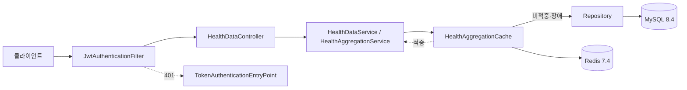

# 오케어 건강활동 데이터 수집 백엔드

삼성헬스와 Apple Health에서 전달되는 건강활동 데이터를 일관된 기준으로 저장하고, 회원별 일간·월간
통계를 제공하는 백엔드 채용 과제입니다.

구현을 완료했습니다. `docker compose up --build -d` 후 아래 [실행과 검증](#실행과-검증)의 명령을
그대로 따라가면 회원가입부터 일간·월간 조회까지 확인할 수 있습니다.

## 과제 제출물 위치

| 과제 원문 요구 | 위치 |
|---|---|
| 1. 소스코드(코멘트 추가) | 이 저장소. 주석 원칙은 [`AGENTS.md`](./AGENTS.md) |
| 2. 데이터베이스 설계 ERD (코멘트 추가) | [데이터베이스 설계](./docs/설계/데이터베이스_설계.md) |
| 3. 데이터 조회 결과 (Daily/Monthly) | [아래 조회 결과](#조회-결과-제출물-3번) |
| 4. 구현 방법 및 설명 | [프로젝트 구조](#프로젝트-구조), [필드 설명](#필드-설명), [발생한 이슈와 해결 방법](#발생한-이슈와-해결-방법) |

실행 명령과 관찰값은 [검증 결과](./docs/검증/검증_결과.md)에 경계별로 기록했습니다.

## 구현 범위

- 이름, 닉네임, 이메일과 비밀번호를 사용한 회원가입
- 이메일과 비밀번호를 사용한 로그인, 액세스 토큰 재발급과 로그아웃
- 삼성헬스·Apple Health 건강활동 데이터 저장과 재전송 멱등 처리
- 회원과 `recordkey` 간 소유권 분리
- `recordkey`별 Daily·Monthly 집계 조회
- Redis 조회 캐시와 Redis 장애 시 MySQL 조회 대체
- 일관된 입력 검증과 오류 응답

입력·출력과 예외 정책은 [기능 명세](./docs/명세/기능_명세.md)가 단일 기준입니다.

## API

업무 API의 기본 경로는 `/api/v1`이고 건강활동 API는 `Authorization: Bearer {accessToken}`이
필요합니다. `/actuator/health`는 기본 경로 밖에 있으며 인증 없이 호출합니다.

| 메서드 | 경로 | 설명 |
|---|---|---|
| `POST` | `/auth/signup` | 회원가입 |
| `POST` | `/auth/login` | 로그인. 액세스·리프레시 토큰 발급 |
| `POST` | `/auth/refresh` | 리프레시 토큰으로 재발급. 기존 토큰은 폐기 |
| `POST` | `/auth/logout` | 전달한 리프레시 토큰 폐기 |
| `POST` | `/health-data` | 건강활동 데이터 저장 |
| `GET` | `/health-data/daily` | 일간 집계 조회 |
| `GET` | `/health-data/monthly` | 월간 집계 조회 |
| `GET` | `/actuator/health` | 기동 확인. 인증 없이 호출 |

오류 응답은 `code`, `message`, `fieldErrors`, `traceId`, `timestamp`를 갖는 한 가지 형식입니다.

```bash
BASE=http://localhost:8080

# 회원가입
curl -s -X POST $BASE/api/v1/auth/signup -H 'Content-Type: application/json' \
  -d '{"name":"홍길동","nickname":"길동","email":"okcare@example.com","password":"StrongPassword1"}'
# {"id":1,"name":"홍길동","nickname":"길동","email":"okcare@example.com"}

# 로그인
TOKEN=$(curl -s -X POST $BASE/api/v1/auth/login -H 'Content-Type: application/json' \
  -d '{"email":"okcare@example.com","password":"StrongPassword1"}' \
  | python3 -c 'import json,sys; print(json.load(sys.stdin)["accessToken"])')

# 저장
curl -s -X POST $BASE/api/v1/health-data -H "Authorization: Bearer $TOKEN" \
  -H 'Content-Type: application/json' --data-binary @fixtures/health/INPUT_DATA1.json
# {"recordKey":"7836887b-...","received":1066,"inserted":1066,"updated":0,"duplicated":0}

# 같은 파일 재전송 — 행이 늘지 않고 duplicated로 계산
curl -s -X POST $BASE/api/v1/health-data -H "Authorization: Bearer $TOKEN" \
  -H 'Content-Type: application/json' --data-binary @fixtures/health/INPUT_DATA1.json
# {"recordKey":"7836887b-...","received":1066,"inserted":0,"updated":0,"duplicated":1066}

# 일간 조회
curl -s -G $BASE/api/v1/health-data/daily -H "Authorization: Bearer $TOKEN" \
  --data-urlencode 'recordKey=7836887b-b12a-440f-af0f-851546504b13' \
  --data-urlencode 'from=2024-11-15' --data-urlencode 'to=2024-11-17'
# {"recordKey":"7836887b-...","zoneId":"Asia/Seoul","items":[
#   {"date":"2024-11-15","steps":7243,"calories":289.209952,"distance":5.419490}, ...]}

# 월간 조회
curl -s -G $BASE/api/v1/health-data/monthly -H "Authorization: Bearer $TOKEN" \
  --data-urlencode 'recordKey=7836887b-b12a-440f-af0f-851546504b13' \
  --data-urlencode 'from=2024-11' --data-urlencode 'to=2024-12'
# {"recordKey":"7836887b-...","zoneId":"Asia/Seoul","items":[
#   {"month":"2024-11","steps":124783,"calories":5002.499439,"distance":94.342095}, ...]}
```

조회 범위는 일간 366일, 월간 24개월까지입니다. 데이터가 없는 날짜와 월도 `0`으로 채워 반환하므로
상한이 없으면 응답 크기가 요청으로 정해집니다.

## 조회 결과 (제출물 3번)

아래는 네 입력 파일을 저장한 뒤 실기동 컨테이너에 실제 HTTP로 조회한 결과입니다. 값은 응답 원문
그대로이며, `calories`가 `0.000000`인 두 `recordkey`는 입력에 칼로리가 없는 공급자입니다.

### Monthly (전체)

| Monthly | Steps | calories | distance | recordkey |
|---|---:|---:|---:|---|
| 2024-11 | 124783 | 5002.499439 | 94.342095 | `7836887b-b12a-440f-af0f-851546504b13` |
| 2024-12 | 115592 | 4635.839580 | 87.376336 | `7836887b-b12a-440f-af0f-851546504b13` |
| 2024-11 | 130945 | 4671.769338 | 100.719233 | `3b87c9a4-f983-4168-8f27-85436447bb57` |
| 2024-12 | 130551 | 4560.129602 | 101.096961 | `3b87c9a4-f983-4168-8f27-85436447bb57` |
| 2024-11 | 115958 | 0.000000 | 92.766321 | `7b012e6e-ba2b-49c7-bc2e-473b7b58e72e` |
| 2024-12 | 113882 | 0.000000 | 91.105717 | `7b012e6e-ba2b-49c7-bc2e-473b7b58e72e` |
| 2024-11 | 136245 | 0.000000 | 108.996000 | `e27ba7ef-8bb2-424c-af1d-877e826b7487` |
| 2024-12 | 136851 | 0.000000 | 109.480800 | `e27ba7ef-8bb2-424c-af1d-877e826b7487` |

### Daily (recordkey별 대표 구간)

데이터가 있는 날짜는 `recordkey`마다 32일입니다. 전체를 싣는 대신 첫 사흘을 보이고, 나머지는 위
`curl` 명령의 `from`·`to`를 바꿔 재현할 수 있습니다.

| Daily | Steps | calories | distance | recordkey |
|---|---:|---:|---:|---|
| 2024-11-15 | 7243 | 289.209952 | 5.419490 | `7836887b-b12a-440f-af0f-851546504b13` |
| 2024-11-16 | 10717 | 425.529948 | 8.020480 | `7836887b-b12a-440f-af0f-851546504b13` |
| 2024-11-17 | 7390 | 288.489966 | 5.608010 | `7836887b-b12a-440f-af0f-851546504b13` |
| 2024-11-15 | 9589 | 345.359934 | 7.243230 | `3b87c9a4-f983-4168-8f27-85436447bb57` |
| 2024-11-16 | 5075 | 199.239996 | 4.263790 | `3b87c9a4-f983-4168-8f27-85436447bb57` |
| 2024-11-17 | 5179 | 183.689983 | 3.983110 | `3b87c9a4-f983-4168-8f27-85436447bb57` |
| 2024-11-15 | 7542 | 0.000000 | 6.033970 | `7b012e6e-ba2b-49c7-bc2e-473b7b58e72e` |
| 2024-11-16 | 6630 | 0.000000 | 5.303651 | `7b012e6e-ba2b-49c7-bc2e-473b7b58e72e` |
| 2024-11-17 | 1708 | 0.000000 | 1.366400 | `7b012e6e-ba2b-49c7-bc2e-473b7b58e72e` |
| 2024-11-15 | 6672 | 0.000000 | 5.337600 | `e27ba7ef-8bb2-424c-af1d-877e826b7487` |
| 2024-11-16 | 12450 | 0.000000 | 9.960000 | `e27ba7ef-8bb2-424c-af1d-877e826b7487` |
| 2024-11-17 | 233 | 0.000000 | 0.186400 | `e27ba7ef-8bb2-424c-af1d-877e826b7487` |

**자동 테스트는 [기능 명세의 회귀 기준](./docs/명세/기능_명세.md#8-회귀-기준)에 적힌 월간 값을 매
빌드마다 실제 API 응답과 대조합니다.** 위 표는 같은 값을 실기동에서 떠 와 옮긴 것이며, 테스트가 읽는
것은 기능 명세입니다. 두 곳의 값이 어긋나면 기능 명세가 옳습니다.

## 필드 설명

과제 원문이 지정한 네 필드입니다. 저장 타입이 과제 표기와 다른 이유를 함께 적었습니다.

| 필드 | 과제 표기 | 저장 타입 | 이유 |
|---|---|---|---|
| `steps` | 걸음수(int) | `DECIMAL(24,12)` | **입력에 소수 걸음수가 1,498건 있습니다.** `int`로 받으면 잘립니다. 집계를 마친 뒤 정수로 반올림해 응답합니다 |
| `calories` | 소모 칼로리(float) | `DECIMAL(24,12)` | `float`은 합산에서 오차가 누적됩니다. 응답은 소수점 여섯 자리 |
| `distance` | 이동거리(float) | `DECIMAL(24,12)` | 입력에 소수점 20자리 값이 있습니다. 응답은 소수점 여섯 자리 |
| `recordkey` | 사용자 구분 키(varchar) | `CHAR(36)` | 입력이 항상 UUID 36자입니다. 고정 길이라 `CHAR`가 맞습니다 |

응답 단계에서 걸음수는 정수, 칼로리와 거리는 소수점 여섯 자리로 `HALF_UP` 반올림합니다. **반올림은
집계를 모두 마친 뒤 한 번만 합니다.**

## 프로젝트 구조

```
src/main/java/com/okcare/assignment/
├── auth/            인증 — 로그인, 재발급, 로그아웃, JWT, 리프레시 토큰 저장소
├── member/          회원가입
├── health/          건강활동 — 정규화, 멱등 저장, 집계 조회, 캐시
├── common/          오류 응답 형식, 인증 필터, 해시
└── config/          설정 속성, 보안 설정, 기동 검증
```

`auth`와 `health`는 네 계층으로 나뉩니다. `member`는 회원가입 하나만 담당해 `api`가 없고, 가입
엔드포인트는 인증과 함께 `auth/api/AuthController`에 있습니다.

| 계층 | 책임 |
|---|---|
| `api` | HTTP 계약, 요청 검증, 응답 변환. **반올림이 여기서만 일어납니다** |
| `application` | 정규화, 소유권, 멱등 저장, 캐시 무효화 |
| `domain` | 엔티티와 값 객체. 상태 변경은 도메인 메서드로 |
| `infrastructure` | 리포지토리, Redis 접근 |

```
docs/
├── 요구사항/    과제 원문, 비즈니스 기획
├── 명세/        기능 명세 (외부 동작 계약과 회귀 기준)
├── 설계/        개발 계획, 데이터베이스 설계
├── 검증/        검증 결과 (경계별 실행 명령과 관찰값)
└── 운영/        작업·문서·Git·리뷰·테스트 가이드
```

`fixtures/health`에 과제가 제공한 네 입력 파일이 있고 회귀 테스트가 그것을 직접 읽습니다.

### 요청이 지나는 경로



## 기술 스택

| 영역 | 기술 |
|---|---|
| Language | Java 17 |
| Framework | Spring Boot 3.5 |
| Persistence | Spring Data JPA |
| Database | MySQL 8.4 |
| Cache / Token Store | Redis 7.4 |
| Migration | Flyway |
| Security | Spring Security, JWT(jjwt), BCrypt |
| Test | JUnit 5, AssertJ, Mockito, Testcontainers |
| 실행 환경 | Docker, Docker Compose |

## 발생한 이슈와 해결 방법

구현 중 실제로 겪은 것만 적었습니다. 각 항목은 재현 방법과 함께
[검증 결과](./docs/검증/검증_결과.md)에 남겼습니다.

### 1. 과제 표기와 실제 입력 데이터가 달랐습니다

과제 원문은 `steps`를 `int`로 적었지만 **Apple Health 입력에 소수 걸음수가 1,498건** 있었습니다.
`int`로 받으면 조용히 잘립니다.

측정값 전부를 `DECIMAL(24,12)`로 저장하고 **집계를 마친 뒤 걸음수만 정수로 반올림**했습니다. 소수점
12자리를 넘겨 버리는 자리의 영향을 측정해 4,710건 누적 오차가 응답 정밀도보다 약 3,914배 작음을
확인했습니다.

### 2. 공급자마다 시각 표현이 달라 집계 날짜가 하루씩 밀릴 수 있었습니다

삼성헬스는 타임존 없는 로컬 시각, Apple Health는 오프셋 시각을 보냅니다. **UTC 날짜와 서울 날짜가
다른 엔트리가 450건이고 그중 11건은 월까지 넘어갑니다**(UTC 11월 30일 21시 → 서울 12월 1일 06시).

공급자별 파서를 나누고 `ResolverStyle.STRICT`를 적용했습니다. STRICT가 아니면 `2024-02-30`이 조용히
2월 29일로 보정됩니다. 집계 기준 날짜는 저장 시점에 `Asia/Seoul`로 확정해 컬럼에 넣었습니다.

### 3. 같은 회원이 같은 recordkey로 동시에 저장하면 500이 났습니다

두 요청이 서로 커밋 전에 기존 레코드를 조회해 양쪽이 신규로 분류하고, 패자가 UNIQUE 위반을
받았습니다. **실기동 검증에서 드러났고 자동 테스트로 재현했습니다.**

레코드를 쓰기 전에 연결 행을 `PESSIMISTIC_WRITE`로 잠가 같은 연결의 저장을 직렬화했습니다. 재시도로
해결하지 않은 이유는 "몇 번이면 충분한가"에 답이 없기 때문입니다.

### 4. 월간 집계를 일간 결과에서 굴려 올리면 값이 어긋났습니다

명세가 "집계를 마친 뒤" 반올림하라고 정합니다. 일별로 반올림한 값을 월별로 더하면 **회귀값 8행 중
5행이 어긋납니다** — 걸음 ±1, 소수 여섯째 자리 ±1~2. 눈으로는 걸러지지 않는 크기입니다.

월간을 원본 행에서 직접 집계하고, 반올림은 응답 객체 한 곳에서만 하도록 했습니다. 굴려 올리면 안
된다는 것을 테스트로 고정했습니다.

### 5. 캐시가 저장 전 값을 새 세대 키에 실을 수 있었습니다

집계 서비스에 `@Transactional(readOnly = true)`가 붙어 있어 소유권 조회가 첫 DB 읽기가 되고 스냅샷이
그 시점에 고정됐습니다. 그 뒤 읽는 Redis 세대 번호는 더 새로울 수 있어, **저장 전 값이 새 세대 키에
실려 TTL 동안 후속 조회에도 나갔습니다.**

트랜잭션 경계를 없애 집계 쿼리가 세대 번호를 읽은 뒤 자기 스냅샷을 만들게 했습니다. 요청 안의 두
시점을 `latch`로 붙잡는 경쟁 테스트를 만들어 고정했습니다.

### 6. 테스트가 통과하는데 검증하지 못하는 자리들이 있었습니다

- **응답 소수 자리**: JSON 트리로 읽으면 Jackson이 `0.000000`을 `0.0`으로, `BigDecimal`로 바꿔도
  node factory가 trailing zero를 떼어 `0`으로 만듭니다. 계약이 전송되는 문자열이므로 **응답
  원문**을 비교하도록 바꿨습니다
- **실행 계획**: 인덱스명이 `possible_keys`에도 있어 테이블 스캔을 골라도 단언이 통과했습니다.
  실제로 고른 `key`와 `used_key_parts`를 보도록 바꿨습니다. 대량 삽입 직후 통계가 낡아 있어
  `ANALYZE TABLE`을 먼저 실행합니다
- **회귀 기준 순서**: `Map.copyOf`가 JVM 실행마다 순회 순서를 무작위화해, 첫 항목을 쓰는 테스트가
  실행마다 다른 `recordkey`를 골랐습니다. 순서 보존 불변 뷰로 바꿨습니다

각 수정이 실제로 회귀를 잡는지 **구현을 의도적으로 망가뜨려 확인**했습니다.

### 7. 프레임워크 기본값이 명세에 없는 동작을 노출했습니다

Spring Security의 기본 `LogoutFilter`가 명세에 없는 `/logout`을 302로 열어 두고, 기본 사용자
자동 구성이 **생성 비밀번호를 시작 로그에 남겼습니다.**

기본 logout configurer를 비활성화하고 `UserDetailsService` 자동 구성을 제외했습니다. 제외를
애노테이션이 아니라 설정 속성으로 둔 이유는 애노테이션 제외가 `@WebMvcTest` 슬라이스에 전파되지 않기
때문입니다.

## 실행과 검증

```bash
cp .env.example .env
docker compose up --build -d
docker compose ps
curl --fail http://localhost:8080/actuator/health
```

세 서비스가 healthy가 되면 `/actuator/health`가 MySQL과 Redis 연결 상태를 함께 반환합니다. 이어서 위
[API](#api)의 `curl` 명령을 순서대로 실행하면 저장과 조회를 확인할 수 있습니다.

데이터를 보존한 채 종료하려면 `docker compose down`을, 볼륨까지 제거하려면
`docker compose down --volumes`를 사용합니다.

빌드와 테스트는 다음 명령으로 실행합니다. 통합 테스트가 Testcontainers로 MySQL과 Redis를 띄우므로
Docker가 실행 중이어야 합니다.

```bash
./gradlew clean build
```

`macOS`에서 이미지 빌드가 `load metadata for eclipse-temurin` 단계에서 멈추면 멀티아치 매니페스트
해석 문제입니다. 베이스 이미지를 먼저 받아 두면 해결됩니다.

```bash
docker pull --platform linux/arm64 eclipse-temurin:17-jdk
docker pull --platform linux/arm64 eclipse-temurin:17-jre
```

## 검증 요약

| 수준 | 건수 | 대상 |
|---|---:|---|
| Unit | 104 | 정규화, 반올림, 범위 검증, 캐시 키와 예외 격리, JWT |
| JSON Slice | 23 | 응답 직렬화 형식, fixture 정규화 회귀 |
| MVC Slice | 55 | HTTP 계약, 공개·보호 경로, 오류 응답 형식 |
| Integration | 67 | 실제 MySQL·Redis에서 저장·조회·캐시·장애 대체·E2E 여정 |

**전체 249건.** Docker 실기동에서 이미지 빌드부터 로그아웃까지 9단계를 확인했고, Redis 컨테이너를
정지시킨 채로도 일간·월간 조회가 `200`이며 응답 원문이 정지 전과 동일했습니다. 로그에 평문 비밀번호,
토큰, `recordkey`와 측정값이 남지 않는 것도 확인했습니다.

자세한 명령과 관찰값은 [검증 결과](./docs/검증/검증_결과.md)에 있습니다.

## 에이전트 작업 하네스

작업 규칙을 문서로만 두지 않고 도구가 강제하도록 구성했습니다. 규칙 원본은 `docs/`에 한 벌만 두고,
[`.agents/`](./.agents)(Codex)와 [`.claude/`](./.claude)(Claude Code)는 그 위의 얇은 어댑터입니다.

| 계층 | 역할 |
|---|---|
| `docs/운영/` | 작업 계획, 문서 작성, Git, 오케스트레이션 규칙의 단일 원본 |
| `.claude/rules/` | 해당 경로의 파일을 열 때만 로드되는 구현 규칙 |
| `.claude/skills/` | 경계 보고, 커밋, 문서 동기화, 회귀 검증 절차 |
| `.claude/hooks/` | 문서 링크·줄 끝 공백 검사와 커밋 직전 자격 증명 차단 |
| `.claude/settings.json` | Git 명령 사용자 확인, `.env` 읽기 차단, 커밋 트레일러 설정 |

저장소를 새로 받은 뒤에는 Claude Code를 다시 시작하고 workspace trust를 수락해야 규칙, 스킬과 훅이
로드됩니다. 확인은 `/context`의 Memory files 항목에서 `CLAUDE.md`가 보이는지로 합니다.

## 문서

- [과제 원문](./docs/요구사항/과제_원문.md)
- [비즈니스 기획](./docs/요구사항/비즈니스_기획.md)
- [기능 명세](./docs/명세/기능_명세.md)
- [개발 계획](./docs/설계/개발_계획.md)
- [데이터베이스 설계](./docs/설계/데이터베이스_설계.md)
- [검증 결과](./docs/검증/검증_결과.md)
- [작업 원칙](./AGENTS.md)과 [Claude Code 진입점](./CLAUDE.md)

## 진행 상태

- [x] 과제 원문 보존과 입력 데이터 분석
- [x] 비즈니스 범위, 기능 계약과 개발 계획 정리
- [x] 에이전트 작업 하네스 구성
- [x] Spring Boot·MySQL·Redis·Docker 기반 구축
- [x] 회원가입과 인증 구현
- [x] 건강활동 데이터 정규화와 멱등 저장
- [x] Daily·Monthly 집계와 Redis 조회 캐시
- [x] 통합·회귀·E2E·Docker 스모크 검증
- [x] ERD와 실제 검증 결과 작성
