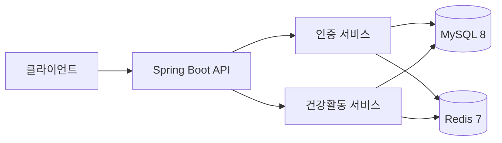

# 오케어 건강활동 데이터 수집 백엔드

삼성헬스와 Apple Health에서 전달되는 건강활동 데이터를 일관된 기준으로 저장하고, 회원별 일간·월간 통계를 제공하는 백엔드 채용 과제입니다.

> 현재 저장소는 요구사항과 설계 문서, 작업 하네스에 더해 Spring Boot·MySQL·Redis·Docker 실행 기반까지 구성한 단계입니다. `docker compose up`으로 세 서비스를 기동하고 상태를 확인할 수 있으며, 회원가입·인증과 건강활동 API는 아직 구현하지 않았습니다. 기능과 검증 결과는 개발 단계에 맞춰 추가하고 이 문서를 함께 갱신합니다.

## 프로젝트 목표

공급자마다 다른 시간 표현과 숫자 형식을 신뢰할 수 있는 내부 형식으로 정리하고, 동일 데이터가 반복 전송되어도 중복 없이 보존하는 것이 핵심 목표입니다.

인증된 회원만 자신에게 연결된 건강 데이터를 저장하고 조회할 수 있어야 합니다. 조회 결과는 공급자 차이와 관계없이 동일한 구조로 제공하며, 조회 캐시에 장애가 발생해도 영속 데이터 조회는 계속 제공해야 합니다.

## 구현 범위

- 이름, 닉네임, 이메일과 비밀번호를 사용한 회원가입
- 이메일과 비밀번호를 사용한 로그인
- 액세스 토큰 재발급과 로그아웃
- 삼성헬스·Apple Health 건강활동 데이터 저장
- 동일 데이터 재전송에 대한 멱등 처리
- 회원과 `recordkey` 간 소유권 분리
- `recordkey`별 Daily·Monthly 집계 조회
- 일관된 입력 검증과 오류 응답
- Redis 장애 시 MySQL 조회 대체

상세한 입력·출력과 예외 정책은 [기능 명세](./docs/명세/기능_명세.md)를 기준으로 합니다.

## 핵심 설계 방향

### 공급자 데이터 정규화

- 삼성헬스의 타임존 없는 시각은 `Asia/Seoul`로 해석합니다.
- Apple Health의 오프셋 시각은 요청의 오프셋을 적용합니다.
- 절대 시각은 UTC로 정규화하고 일간·월간 집계는 `Asia/Seoul`을 기준으로 합니다.
- 걸음수, 칼로리와 거리는 `BigDecimal`로 처리하고 소수점 열두 자리까지 보존합니다.

### 멱등성과 데이터 정합성

- 같은 `recordkey`, 지표 종류와 측정 구간을 동일한 레코드로 판단합니다.
- 같은 값의 재전송은 중복 처리하고 값이 바뀌면 최신 값으로 갱신합니다.
- 애플리케이션 로직뿐 아니라 MySQL UNIQUE 제약조건과 트랜잭션으로 중복을 최종 방어합니다.

### 인증과 소유권

- 비밀번호는 BCrypt 계열로 해시하고 JWT의 서명과 만료를 검증합니다.
- 처음 수집한 `recordkey`를 인증 회원에게 연결합니다.
- 다른 회원의 데이터에는 저장과 조회 모두 접근할 수 없습니다.

### 영속 데이터와 캐시

- MySQL을 회원과 건강활동 데이터의 원본으로 사용합니다.
- Redis는 리프레시 토큰 저장과 집계 조회 캐시에 사용합니다.
- 집계 캐시는 Cache-Aside 방식으로 구성하고, Redis 장애 시 MySQL 결과를 반환합니다.

## 예정 아키텍처



## 기술 스택

| 영역 | 기술 |
|---|---|
| Language | Java 17 |
| Framework | Spring Boot 3.x |
| Persistence | Spring Data JPA |
| Database | MySQL 8.x |
| Cache / Token Store | Redis 7.x |
| Migration | Flyway |
| Security | Spring Security, JWT, BCrypt |
| Test | JUnit 5, AssertJ, Testcontainers |
| API 문서 | Spring REST Docs |
| 실행 환경 | Docker, Docker Compose |

프레임워크와 컨테이너 버전은 기반 구축 단계에서 호환성을 확인해 [`build.gradle`](./build.gradle)과 [`compose.yaml`](./compose.yaml)에 고정했습니다.

## 입력 데이터 분석

제공된 네 JSON 파일은 총 4,710건의 건강활동 레코드를 포함합니다.

| 구분 | 레코드 수 | 주요 특성 |
|---|---:|---|
| SamsungHealth | 2,563 | 타임존 없는 시각, 숫자형 `steps`, 0분 측정 구간 15건 |
| Apple Health | 2,147 | 오프셋 시각, 문자열형 `steps`, 소수 걸음수 1,498건 |

회귀 테스트에는 [`fixtures/health`](./fixtures/health)의 원본 파일과 [기능 명세의 기대값](./docs/명세/기능_명세.md#8-회귀-기준)을 사용합니다.

## 검증 계획

- 정규화, 반올림과 멱등성 단위 테스트
- 요청 검증과 인증 흐름 MVC 슬라이스 테스트
- MySQL·Redis Testcontainers 통합 테스트
- 제공된 네 JSON 파일을 사용한 회귀 테스트
- 전체 사용자 흐름 E2E 테스트
- Docker Compose 환경의 실제 API 스모크 테스트

최종 검증에서는 컨테이너 이미지 빌드, 세 서비스 healthcheck, Flyway migration, 회원가입·로그인, 데이터 저장·재전송, Daily·Monthly 조회와 Redis 장애 대체 흐름을 확인합니다.

## 실행과 검증

다음 명령으로 애플리케이션, MySQL과 Redis를 함께 기동합니다.

```bash
cp .env.example .env
docker compose up --build -d
docker compose ps
curl --fail http://localhost:8080/actuator/health
```

세 서비스가 모두 healthy가 되면 `/actuator/health`가 MySQL과 Redis 연결 상태를 함께 반환합니다. 회원가입·인증과 건강활동 API는 아직 구현하지 않아 호출할 수 없습니다.

데이터를 보존한 채 종료하려면 `docker compose down`을, 볼륨까지 제거하려면 `docker compose down --volumes`를 사용합니다.

빌드와 테스트는 다음 명령으로 실행합니다. 통합 테스트가 Testcontainers로 MySQL을 띄우므로 Docker가 실행 중이어야 합니다.

```bash
./gradlew clean build
```

## 에이전트 작업 하네스

작업 규칙을 문서로만 두지 않고 도구가 강제하도록 구성했습니다. 규칙 원본은 `docs/`에 한 벌만 두고, [`.agents/`](./.agents)(Codex)와 [`.claude/`](./.claude)(Claude Code)는 그 위의 얇은 어댑터입니다.

| 계층 | 역할 |
|---|---|
| `docs/운영/` | 작업 계획, 문서 작성, Git, 오케스트레이션 규칙의 단일 원본 |
| `.claude/rules/` | 해당 경로의 파일을 열 때만 로드되는 구현 규칙 |
| `.claude/skills/` | 경계 보고, 커밋, 문서 동기화, 회귀 검증 절차 |
| `.claude/hooks/` | 문서 링크·줄 끝 공백 검사와 커밋 직전 자격 증명 차단 |
| `.claude/settings.json` | Git 명령 사용자 확인, `.env` 읽기 차단, 커밋 트레일러 설정 |

저장소를 새로 받은 뒤에는 Claude Code를 다시 시작하고 workspace trust를 수락해야 규칙, 스킬과 훅이 로드됩니다. 확인은 `/context`의 Memory files 항목에서 `CLAUDE.md`가 보이는지로 합니다.

## 문서

- [과제 원문](./docs/요구사항/과제_원문.md)
- [비즈니스 기획](./docs/요구사항/비즈니스_기획.md)
- [기능 명세](./docs/명세/기능_명세.md)
- [개발 계획](./docs/설계/개발_계획.md)
- [작업 원칙](./AGENTS.md)과 [Claude Code 진입점](./CLAUDE.md)

## 진행 상태

- [x] 과제 원문 보존과 입력 데이터 분석
- [x] 비즈니스 범위, 기능 계약과 개발 계획 정리
- [x] 에이전트 작업 하네스 구성
- [x] Spring Boot·MySQL·Redis·Docker 기반 구축
- [ ] 회원가입과 인증 구현
- [ ] 건강활동 데이터 정규화와 멱등 저장
- [ ] Daily·Monthly 집계와 Redis 조회 캐시
- [ ] 통합·회귀·E2E·Docker 스모크 검증
- [ ] ERD, API 문서와 실제 검증 결과 작성
