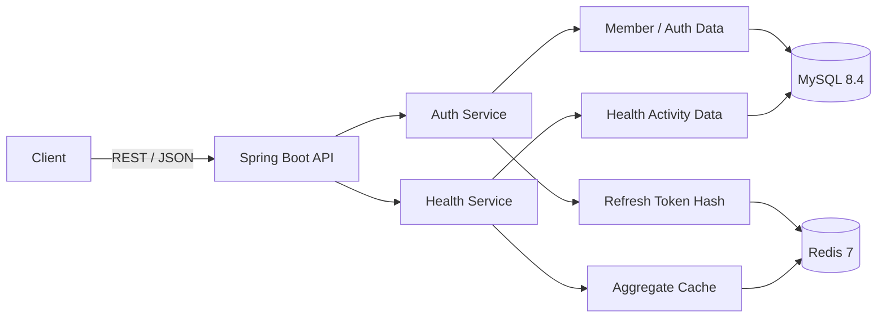

# 오케어 백엔드 개발 계획

## 1. 문서 목적

이 문서는 승인된 기능을 기술 구조, 저장 방식, 실행 환경, 테스트와 구현 순서로 구체화합니다. 서비스의
배경과 범위는 [`비즈니스_기획.md`](../요구사항/비즈니스_기획.md), 외부 계약은
[`기능_명세.md`](../명세/기능_명세.md)를 기준으로 합니다.

과제 원문은 [`과제_원문.md`](../요구사항/과제_원문.md)에 보존하고, 공통 작업 원칙과 운영 절차는
루트 [`AGENTS.md`](../../AGENTS.md)와 관련 운영 가이드에서 관리합니다. 실행 명령과 관찰 결과는
[`README.md`](../../README.md)와 [`검증_결과.md`](../검증/검증_결과.md)에 기록합니다.

## 2. 구현 계약

- 이 문서와 기능 명세에 적힌 범위, 이후 사용자가 승인한 변경만 구현합니다.
- 기능 정책이 필요하면 [`기능_명세.md`](../명세/기능_명세.md)를 먼저 보완합니다.
- 기술 설계가 바뀌면 이 문서와 관련 테스트·운영 절차를 함께 갱신합니다.
- 기능 규칙과 공통 개발 규칙은 이 문서에 복제하지 않고 기준 문서로 연결합니다.

## 3. 기술 목표

- 단일 REST API 애플리케이션과 MySQL·Redis 의존 서비스를 재현 가능한 환경으로 제공합니다.
- MySQL을 회원·건강활동 데이터의 영속 원본으로, Redis를 리프레시 토큰 저장과 집계 캐시로 사용합니다.
- Flyway와 Testcontainers로 스키마 변경과 MySQL·Redis 통합 동작을 검증합니다.

## 4. 기술 스택

| 영역 | 선택 | 목적 |
|---|---|---|
| Language | Java 17 | 과제 지정 버전 |
| Framework | Spring Boot 3.5.16 | REST API와 의존성 관리 |
| Persistence | Spring Data JPA | 도메인 영속화 |
| Migration | Flyway | 재현 가능한 스키마 변경 |
| Database | MySQL 8.4 | 영속 데이터 원본 |
| Cache / Token Store | Redis 7 (`redis:7-alpine`) | 리프레시 토큰과 집계 캐시 |
| Security | Spring Security, JWT, BCrypt | 인증·인가와 비밀번호 보호 |
| Build | Gradle Wrapper | 동일한 빌드 도구 버전 제공 |
| Test | JUnit 5, AssertJ, Testcontainers | 단위·슬라이스·통합 테스트 |
| Runtime | Docker, Docker Compose | 실행 환경 재현 |

구현 버전은 `build.gradle`, Gradle Wrapper와 `compose.yaml`을 기준으로 합니다. 버전을 변경할 때는
호환성 검증과 검증 결과 문서의 실행 환경을 함께 갱신합니다.

## 5. 아키텍처



### 5.1 계층 책임

- Controller는 HTTP 계약, 인증 주체 해석, 입력 검증과 응답 변환을 담당합니다.
- Service는 회원가입, 인증, 정규화, 소유권, 멱등 저장과 캐시 무효화를 담당합니다.
- Repository는 영속화, 소유권 조회와 집계 쿼리를 담당합니다.
- 외부 입력 DTO, API 응답 DTO와 JPA Entity를 분리합니다.
- 의존성은 생성자로 주입하고 필드 주입을 사용하지 않습니다.
- 불변 요청·응답 DTO는 Java `record`를 우선 검토합니다.
- JPA Entity는 `protected` 기본 생성자를 두고 의미 있는 도메인 메서드로 상태를 변경합니다.
- `@ManyToOne`과 `@OneToOne`은 명확한 이유가 없으면 LAZY 로딩을 사용합니다.
- 단순 CRUD에 불필요한 Port, Adapter, Strategy, Factory와 멀티모듈을 추가하지 않습니다.
- `@RequestBody`에는 `@Valid`를 적용하고 비즈니스 예외는 Service 또는 도메인에서 발생시킵니다.
- 전역 예외 처리기는 HTTP 상태, 내부 오류 코드와 메시지의 의미를 일치시킵니다.
- 소유권은 조회 후 결과 필터링이 아니라 Service 검증 또는 조회 조건으로 강제합니다.
- 응답에는 기능 계약에 필요한 필드만 포함하고 내부 상태를 노출하지 않습니다.
- 공급자별 시간·숫자 차이는 건강 데이터 정규화 계층에서 내부 모델로 변환합니다.

### 5.2 패키지 구조

```text
com.okcare.assignment
├── auth
│   ├── api
│   ├── application
│   ├── domain
│   └── infrastructure
├── member
│   ├── application
│   ├── domain
│   └── infrastructure
├── health
│   ├── api
│   ├── application
│   ├── domain
│   └── infrastructure
├── common
│   ├── error
│   ├── security
│   └── time
└── config
```

기능 단위 패키지를 사용하되 과제 규모를 넘어서는 멀티모듈과 불필요한 추상화는 만들지 않습니다.

### 5.3 주석과 코멘트

주석을 쓰는 기준은 [`AGENTS.md`](../../AGENTS.md)의 「주석 원칙」입니다. 이 절은 그 원칙에 더해 이 과제에만 적용되는 것을 정합니다.

[`과제_원문.md`](../요구사항/과제_원문.md)의 제출물 1번과 2번이 소스코드와 ERD에 코멘트를 요구하므로 주석은 평가 대상입니다. 이 요구를 "많이 쓴다"로 읽지 않습니다.

- 테이블과 컬럼에는 한국어 `COMMENT`를 남깁니다. ERD 코멘트는 그 자체가 제출물이므로 「주석 원칙」의 판별 기준을 적용하지 않습니다.

## 6. 데이터 저장 설계

스키마와 ERD는 [`데이터베이스_설계.md`](./데이터베이스_설계.md)와 Flyway migration을 단일 기준으로
사용합니다. 이 문서는 구현에 필요한 저장 원칙과 선택 이유만 정의합니다.

### 6.1 주요 제약조건

- `members.email`에 UNIQUE 제약조건을 둡니다.
- `health_connections.record_key`에 UNIQUE 제약조건을 둡니다.
- `health_activity_records`에는 다음 UNIQUE 제약조건을 둡니다.

```text
(connection_id, metric_type, period_start_utc, period_end_utc)
```

`connection_id`가 회원 소유의 `record_key`와 공급자 연결을 대표하므로 활동 테이블에 `record_key`와
`source_name`을 중복 저장하지 않습니다.

소유권과 집계 조회에는 다음 복합 인덱스를 사용합니다. 정확한 이름과 DDL은
[`데이터베이스_설계.md`](./데이터베이스_설계.md#4-명명된-제약조건과-인덱스)에서 관리합니다.

- `health_connections(member_id, record_key)`
- `health_activity_records(connection_id, activity_date)`
- `health_activity_records(connection_id, period_start_utc, period_end_utc)`

### 6.2 숫자와 시간 타입

- 절대 시각은 애플리케이션에서 `Instant`, DB에서 UTC `DATETIME(6)`로 저장합니다.
- 오프셋이 있는 API 시각은 `OffsetDateTime`으로 표현합니다.
- 집계 날짜는 `LocalDate`와 DB `DATE`로 저장합니다.
- 측정값은 `BigDecimal`과 `DECIMAL(24, 12)`로 저장하고, 저장 소수 자릿수 맞춤은 정규화 계층에서
  명시적으로 수행합니다. 저장값과 변경 감지 해시의 정밀도를 같게 유지하기 위함입니다.
- 정수부가 컬럼 범위를 넘는 값은 신뢰 경계에서 `400 Bad Request`로 거부합니다. DB 오류로 드러나면
  요청 검증 오류가 서버 오류로 변환됩니다.
- `new BigDecimal(double)`을 사용하지 않고 문자열 또는 `BigDecimal.valueOf`로 생성합니다.
- 나눗셈, scale과 `RoundingMode`를 명시합니다.
- JDBC 세션과 애플리케이션 기본 저장 타임존은 UTC로 고정합니다.
- `Instant`와 지역 시각 변환에는 명시적인 `ZoneId`를 사용합니다.
- 집계 기준 `ZoneId`는 검증된 설정값 `app.business-zone`으로 관리합니다.

### 6.3 Flyway

- 최초 Versioned migration이 회원, 연결, 활동 테이블과 인덱스를 생성합니다.
- 빈 MySQL에 전체 migration을 적용하는 테스트를 둡니다.
- 적용된 migration은 수정하지 않고 새로운 보정 migration으로 전진 처리합니다. 주석도 수정 대상에 포함합니다. checksum은 스크립트 전체로 계산되므로 주석만 고쳐도 기존 데이터베이스가 validation에 실패합니다. 이 때문에 적용된 migration은 「주석 원칙」과 「코드 서식」의 적용 대상에서 제외합니다.
- 타입 변경, NOT NULL 추가와 인덱스 생성은 기존 데이터와 운영 락 영향을 검토합니다.

## 7. 저장 처리

- 요청 JSON 파싱과 공급자별 정규화는 DB 트랜잭션 밖에서 수행합니다.
- `recordkey` 연결 해석과 활동 레코드 저장은 별도 트랜잭션으로 나누고, 동시 연결 생성의 UNIQUE 충돌은
  새 트랜잭션에서 한 번 재조회합니다. 트랜잭션을 분리하는 메서드는 별도 빈으로 둡니다.
- 활동 레코드 저장은 연결 행을 잠근 뒤 제한된 batch로 처리합니다. 응답 카운트는 애플리케이션에서
  분류하고, 동일 식별자의 최종 중복 방지는 MySQL UNIQUE 제약조건으로 보장합니다.
- `payload_hash`는 저장 정밀도로 맞춘 측정값과 단위만 정규 형태로 계산하고, 공급자의 갱신 시각은
  포함하지 않습니다.
- 저장 트랜잭션이 커밋된 뒤 캐시 version을 증가시킵니다. 캐시 무효화 실패가 MySQL 저장을 되돌리지는
  않으며, 다음 조회는 MySQL 원본으로 대체합니다.
- 파일 I/O와 전체 payload 로깅을 DB 트랜잭션에 포함하지 않고, 사용자 입력이 포함된 SQL은 파라미터
  바인딩을 사용합니다.

## 8. Redis 설계

Redis 연결 대기는 1초, 명령 응답 대기는 2초로 제한합니다. 조회 캐시는 명령 시간 초과 후 MySQL로
대체하고, 리프레시 토큰 작업은 Redis 처리를 완료하지 못한 것으로 실패시킵니다.

### 8.1 리프레시 토큰

```text
Key: auth:refresh:{memberId}:{tokenId}
Value: SHA-256(refreshToken)
TTL: 14 days
```

- 평문 토큰을 저장하지 않습니다.
- `{tokenId}`는 토큰 발급 시 생성한 UUID이며 리프레시 토큰의 `jti` 클레임에 같은 값을 넣습니다.
  재발급과 로그아웃은 전달된 토큰만으로 대상 키를 찾아야 하므로 별도 조회 인덱스를 두지 않습니다.
- 재발급 시 기존 토큰 폐기와 새 토큰 저장을 원자적으로 수행합니다.
- 원자성은 단일 Lua 스크립트로 확보합니다. 저장된 해시 대조, 기존 키 삭제와 새 키 저장을 한 번의
  `EVAL`로 수행해 대조와 교체 사이에 다른 요청이 끼어들지 못하게 합니다.
- 로그인은 이미 저장된 토큰을 폐기하지 않으며 서로 다른 `{tokenId}`로 공존합니다.
- 로그인, 재발급과 로그아웃에서 TTL, 회전과 폐기를 통합 테스트합니다.

### 8.2 집계 캐시

```text
health:daily:{recordKey}:{version}:{from}:{to}
health:monthly:{recordKey}:{version}:{from}:{to}
health:cache-version:{recordKey}
```

- Cache-Aside 방식으로 조회합니다.
- Daily 캐시 TTL은 5분, Monthly 캐시 TTL은 10분으로 설정합니다.
- 저장 성공 후 `health:cache-version:{recordKey}`를 증가시킵니다.
- 이전 버전 캐시는 TTL에 따라 자연 만료합니다.
- `KEYS`와 패턴 전체 삭제를 사용하지 않습니다.
- 현재 기능에 필요하지 않은 분산 락을 추가하지 않습니다.
- 캐시 장애 시 제공할 기능 동작은 [`기능_명세.md`](../명세/기능_명세.md)를 따릅니다.
- 캐시 오류를 기록하되 recordkey와 전체 응답 payload를 로그에 남기지 않습니다.

## 9. 설정과 보안

- 관련 설정은 `@ConfigurationProperties`와 `@Validated`로 묶습니다.
- DB·Redis 자격 증명과 JWT secret은 환경변수로 주입합니다.
- 필수 설정이 없거나 JWT secret이 안전 기준을 충족하지 못하면 기동을 실패시킵니다.
- JWT secret은 Base64로 인코딩해 주입합니다. 디코딩 결과가 32바이트(256비트) 미만이거나 Base64
  형식이 아니면 기동을 실패시킵니다. 32바이트는 HS256이 요구하는 최소 키 길이입니다.
- 설정 검증 실패 메시지에 secret 값을 포함하지 않습니다.
- 비밀번호는 `DelegatingPasswordEncoder`의 BCrypt 계열 인코더로 해시합니다.
- JWT의 서명과 만료를 검증하며 `none` 알고리즘을 허용하지 않습니다.
- Actuator는 필요한 health 정보만 공개합니다.
- `/actuator/health`는 인증 없이 접근할 수 있게 열어 둡니다. Compose healthcheck가 이 엔드포인트로
  컨테이너 상태를 판정하므로 막으면 세 서비스가 모두 unhealthy가 됩니다.
- 인증 필터 단계에서 발생한 401도 기능 명세의 오류 응답 형식으로 반환합니다. 전역 예외 처리기는
  필터 단계 예외를 받지 못하므로 별도 진입점이 같은 형식을 만듭니다.
- 오류 응답과 로그에는 비밀번호, 토큰, 개인정보와 전체 건강 데이터 payload를 남기지 않습니다.

## 10. Docker 실행 설계

| 서비스 | 역할 | 외부 포트 |
|---|---|---:|
| `app` | Spring Boot API | 8080 |
| `mysql` | MySQL 8.4 | 3306 |
| `redis` | Redis 7 (`redis:7-alpine`) | 6379 |

### 10.1 Dockerfile

- Gradle Wrapper를 사용하는 multi-stage build로 실행 JAR를 생성합니다.
- 빌드 stage는 Java 17 JDK, 실행 stage는 Java 17 JRE를 사용합니다.
- 애플리케이션은 root가 아닌 전용 사용자로 실행합니다.
- secret을 이미지에 포함하지 않습니다.

### 10.2 Compose

- MySQL과 Redis에 healthcheck를 설정합니다.
- `app`은 의존 서비스가 healthy 상태가 된 후 시작합니다.
- MySQL 데이터는 named volume에 보존합니다.
- Redis는 AOF를 사용합니다.
- `.env.example`만 저장소에 포함하고 실제 `.env`는 제외합니다.
- `/actuator/health`에서 MySQL과 Redis 연결을 확인합니다.

실행과 종료 명령은 [`README.md`](../../README.md#실행과-검증), 실제 기동 결과는
[`검증_결과.md`](../검증/검증_결과.md)에서 관리합니다.

## 11. 테스트 전략

테스트 코드의 목적, 작성 여부, 수준 선택과 리뷰 기준은
[`테스트_작성_가이드.md`](../운영/테스트_작성_가이드.md)를 따릅니다.

변경 코드와 가장 가까운 테스트부터 실행하고 Unit, Slice, MySQL·Redis Integration, E2E, 전체 빌드, Docker API smoke 순서로 검증 범위를 넓힙니다.

### 11.1 단위 테스트

- 이메일 정규화
- 비밀번호 해시와 인증 실패
- 삼성헬스 로컬 시각 파싱
- Apple Health 오프셋 시각 파싱
- 숫자형·문자열형 `steps` 파싱
- 소수 걸음수 합산 후 반올림
- 0분 구간 처리
- payload hash 생성
- 캐시 키와 version 계산

### 11.2 슬라이스 테스트

- 요청 DTO 검증과 오류 응답
- 인증 필요·불필요 경로
- 인증 주체 전달과 소유권 오류 변환

### 11.3 MySQL·Redis 통합 테스트

- 실제 MySQL 방언, FK, UNIQUE 제약조건과 집계 쿼리
- 리프레시 토큰 TTL, 회전과 폐기
- 동일 입력 재전송과 값 변경
- `recordkey` 소유권 충돌
- 캐시 hit·miss와 version 무효화
- Redis 중단 시 MySQL 집계 fallback

멱등성은 사전 조회 결과가 아니라 재전송 후 저장 레코드 수와 응답 카운트로 검증합니다.

### 11.4 회귀 및 E2E

[`../../fixtures/health`](../../fixtures/health)의 네 JSON을 사용합니다. 입력 특성과 Daily/Monthly 기대값은 [`기능_명세.md`](../명세/기능_명세.md)의 회귀 기준을 단일 기준으로 사용합니다.

Docker 환경에서 다음 흐름을 실제 API로 검증합니다.

1. 이미지 빌드와 세 서비스 healthcheck
2. Flyway migration
3. 회원가입과 로그인
4. 네 JSON 저장
5. 동일 JSON 재전송
6. Daily/Monthly 조회
7. 캐시 생성과 저장 후 무효화
8. Redis 장애 중 집계 조회
9. 로그아웃 후 리프레시 토큰 거절

실행 명령과 핵심 결과는 `docs/검증/검증_결과.md`에 기록합니다.

기대값은 테스트 코드에 다시 정의하지 않고 네 입력 파일의 특성과 월간 기대값을 정한
[기능 명세의 회귀 기준](../명세/기능_명세.md#8-회귀-기준) 표를 읽어 사용합니다. 실제 결과가 기대값과
다르면 기대값을 결과에 맞추지 않고 구현과 기준값 중 어느 쪽이 틀렸는지 판단해 보고합니다. 기준값을
바꿔야 하면 `기능_명세.md`를 먼저 갱신하고 사용자 승인을 받습니다.

## 12. 구현 단계와 리뷰 경계

| 경계 | 예상 커밋 메시지 | 포함 범위 | 경계 검증 |
|---:|---|---|---|
| 1 | `docs: 비즈니스·기능·개발 계약 정리` | 과제 원문, 비즈니스 기획, 기능 명세, 개발 계획, fixture | 링크·수치·범위 점검 |
| 2 | `chore: 에이전트 작업 하네스 구성` | `AGENTS.md`, `CLAUDE.md`, `.agents/`, `.claude/`의 규칙·스킬·훅과 권한 설정 | 훅 동작과 문서 링크 점검 |
| 3 | `build: Spring Boot와 Docker 기반 구성` | Gradle, 설정, MySQL·Redis Compose, Flyway 골격, Actuator | 빌드와 세 컨테이너 healthcheck |
| 4 | `feat: 회원가입과 인증 구현` | 회원가입, 로그인, JWT, Redis 리프레시 토큰, 오류 응답 | Unit·MVC·MySQL·Redis 테스트 |
| 5 | `feat: 건강활동 데이터 정규화와 저장` | 공급자 파싱, UTC·숫자 정규화, 소유권, 멱등 저장 | 네 JSON 저장·재전송·변경·권한 테스트 |
| 6 | `feat: 일간·월간 집계 조회 구현` | DB 집계와 응답 계약 | 회귀값과 경계 날짜 테스트 |
| 7 | `feat: Redis 조회 캐시와 장애 대체 구현` | 집계 캐시, version 무효화, Redis 장애 fallback | hit·miss·무효화·fallback 테스트 |
| 8 | `test: 통합 및 회귀 테스트 보강` | Testcontainers와 전체 사용자 흐름 E2E 보강 | 전체 테스트와 빌드 |
| 9 | `docs: ERD·API 예시와 검증 결과 작성` | README, ERD, API, 실제 Docker 검증 결과 | Compose, API smoke와 링크 점검 |

경계 2는 규칙 문서를 기계적으로 강제하는 계층을 코드보다 먼저 두어, 이후 경계의 구현이 같은 기준으로 검증되도록 합니다.

경계 운영과 완료 보고는 [`작업_계획_가이드.md`](../운영/작업_계획_가이드.md), 커밋 승인과 메시지 규칙은 [`Git_작업_가이드.md`](../운영/Git_작업_가이드.md)를 따릅니다.

## 13. 제출 산출물

- GitHub 저장소 주소
- 실행 가능한 소스코드
- Gradle Wrapper
- `Dockerfile`
- `compose.yaml`
- `.env.example`
- Flyway migration
- 단위·슬라이스·통합·회귀 테스트
- `README.md`
- `AGENTS.md`
- `CLAUDE.md`
- `.agents/skills/`
- `.claude/` (규칙, 스킬, 훅, 권한 설정)
- `.codex/default.rules` (Codex 명령 실행 규칙)
- `docs/요구사항/비즈니스_기획.md`
- `docs/명세/기능_명세.md`
- `docs/설계/개발_계획.md`
- `docs/설계/ERD.mmd`
- `docs/설계/ERD.png`
- `docs/운영/작업_계획_가이드.md`
- `docs/운영/테스트_작성_가이드.md`
- `docs/운영/Git_작업_가이드.md`
- `docs/운영/문서_작성_가이드.md`
- `docs/운영/오케스트레이션_가이드.md`
- `docs/운영/LLM_코드_리뷰_가이드.md`
- `docs/설계/데이터베이스_설계.md`
- `docs/검증/조회_결과.md`
- `docs/검증/검증_결과.md`
- Daily/Monthly 샘플 조회 결과
- 프로젝트 구조, 설계 결정과 이슈 해결 방법

API 엔드포인트의 외부 계약과 대표 요청·응답 형식은 기능 명세를 단일 기준으로 사용합니다. README에는
실행 가능한 curl 절차와 짧은 응답 예시를 둡니다. 과제 원문의 제출물은 "구현 방법 및 설명"이고
엔드포인트 설명은 그 일부입니다. Spring REST Docs도 같은 이유로 쓰지 않습니다. 문서를 하나 더 만들면
같은 계약이 세 곳에 생깁니다.

## 14. 기술 완료 조건

- [x] 필수 설정 누락과 안전하지 않은 JWT secret으로 기동되지 않습니다.
- [x] Flyway가 빈 MySQL에 전체 스키마를 생성합니다.
- [x] 적용된 migration을 수정하지 않고 전진 보정할 수 있습니다.
- [x] MySQL UNIQUE 제약조건으로 멱등성을 최종 보장합니다.
- [x] Redis 리프레시 토큰의 TTL, 회전과 폐기가 동작합니다.
- [x] 집계 캐시와 version 무효화가 동작합니다.
- [x] Redis 장애 시 MySQL 집계 조회가 성공합니다.
- [x] 전체 자동 테스트가 통과합니다.
- [x] Docker Compose에서 세 서비스가 healthy 상태가 됩니다.
- [x] 실제 API 검증 절차와 결과가 문서화됩니다.
- [x] 기능 완료 조건은 [`기능_명세.md`](../명세/기능_명세.md)의 계약과 회귀 기준을 모두 만족합니다.

각 항목을 충족한 실행 명령과 관찰값은 [`검증_결과.md`](../검증/검증_결과.md)에 있습니다.
