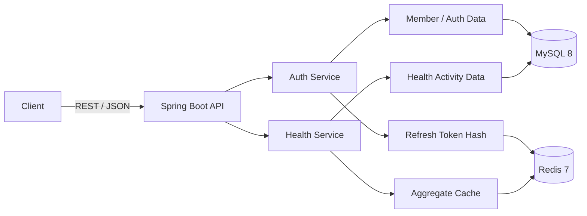
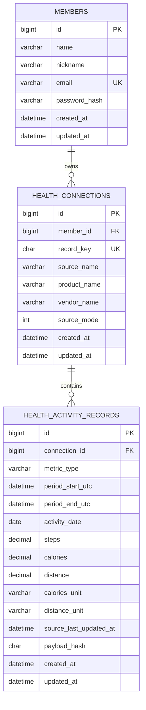

# 오케어 백엔드 개발 계획

## 기준

승인된 기능 계약을 어떤 기술 구조와 순서로 구현하고 검증할지 기록하며, 새로운 기능 정책은 이 문서에서 결정하지 않는다.

## 1. 문서 목적

이 문서는 오케어 백엔드의 기술 구조, 저장 방식, 실행 환경과 구현 순서를 정의한다. 서비스의 배경과 목표는 [`비즈니스_기획.md`](../요구사항/비즈니스_기획.md), 기능 동작과 외부 계약은 [`기능_명세.md`](../명세/기능_명세.md)를 기준으로 한다.

과제 원문은 [`과제_원문.md`](../요구사항/과제_원문.md)에 보존한다. 코드 작성과 검증의 공통 원칙은 루트 [`AGENTS.md`](../../AGENTS.md)를 따른다. 작업 경계, Git과 Orca 운영은 각각 [`작업_계획_가이드.md`](../운영/작업_계획_가이드.md), [`Git_작업_가이드.md`](../운영/Git_작업_가이드.md), [`오케스트레이션_가이드.md`](../운영/오케스트레이션_가이드.md)를 따른다.

최종 결과물은 다음 명령으로 애플리케이션과 의존 서비스를 실제 기동할 수 있어야 한다.

```bash
docker compose up --build
```

## 2. 구현 계약

- 이 문서와 기능 명세에 적힌 범위, 이후 사용자가 승인한 변경만 구현한다.
- 기능 정책이 필요하면 [`기능_명세.md`](../명세/기능_명세.md)를 먼저 보완한다.
- 기술 설계가 바뀌면 이 문서와 관련 테스트·운영 절차를 함께 갱신한다.
- 기능 규칙과 공통 개발 규칙을 이 문서에 복제하지 않고 기준 문서로 연결한다.
- 현재 범위에는 Kafka 비동기 파이프라인과 Kubernetes 배포를 포함하지 않는다.

## 3. 기술 목표

- Java 17과 Spring Boot 기반 단일 REST API 애플리케이션을 구현한다.
- MySQL을 회원과 건강활동 데이터의 영속 원본으로 사용한다.
- Redis를 리프레시 토큰 저장과 집계 조회 캐시에 사용한다.
- Flyway로 빈 데이터베이스와 기존 데이터베이스의 스키마 변경을 재현한다.
- Testcontainers로 MySQL·Redis 통합 동작을 검증한다.
- 애플리케이션, MySQL과 Redis를 Docker Compose로 실행한다.

## 4. 기술 스택

| 영역 | 선택 | 목적 |
|---|---|---|
| Language | Java 17 | 과제 지정 버전 |
| Framework | Spring Boot 3.x | REST API와 의존성 관리 |
| Persistence | Spring Data JPA | 도메인 영속화 |
| Migration | Flyway | 재현 가능한 스키마 변경 |
| Database | MySQL 8.x | 영속 데이터 원본 |
| Cache / Token Store | Redis 7.x | 리프레시 토큰과 집계 캐시 |
| Security | Spring Security, JWT, BCrypt | 인증·인가와 비밀번호 보호 |
| Build | Gradle Wrapper | 동일한 빌드 도구 버전 제공 |
| Test | JUnit 5, AssertJ, Testcontainers | 단위·슬라이스·통합 테스트 |
| Runtime | Docker, Docker Compose | 실행 환경 재현 |

Spring Boot, Gradle, MySQL, Redis와 컨테이너 이미지의 정확한 버전은 기반 구축 경계에서 호환성을 검증한 후 빌드 파일과 Compose에 고정한다.

## 5. 아키텍처



### 5.1 계층 책임

- Controller는 HTTP 계약, 인증 주체 해석, 입력 검증과 응답 변환을 담당한다.
- Service는 회원가입, 인증, 정규화, 소유권, 멱등 저장과 캐시 무효화를 담당한다.
- Repository는 영속화, 소유권 조회와 집계 쿼리를 담당한다.
- 외부 입력 DTO, API 응답 DTO와 JPA Entity를 분리한다.
- 의존성은 생성자로 주입하고 필드 주입을 사용하지 않는다.
- 불변 요청·응답 DTO는 Java `record`를 우선 검토한다.
- JPA Entity는 `protected` 기본 생성자를 두고 의미 있는 도메인 메서드로 상태를 변경한다.
- `@ManyToOne`과 `@OneToOne`은 명확한 이유가 없으면 LAZY 로딩을 사용한다.
- 단순 CRUD에 불필요한 Port, Adapter, Strategy, Factory와 멀티모듈을 추가하지 않는다.
- `@RequestBody`에는 `@Valid`를 적용하고 비즈니스 예외는 Service 또는 도메인에서 발생시킨다.
- 전역 예외 처리기는 HTTP 상태, 내부 오류 코드와 메시지의 의미를 일치시킨다.
- 소유권은 조회 후 결과 필터링이 아니라 Service 검증 또는 조회 조건으로 강제한다.
- 응답에는 기능 계약에 필요한 필드만 포함하고 내부 상태를 노출하지 않는다.
- 공급자별 시간·숫자 차이는 건강 데이터 정규화 계층에서 내부 모델로 변환한다.

### 5.2 패키지 구조

```text
com.okcare.assignment
├── auth
│   ├── api
│   ├── application
│   ├── domain
│   └── infrastructure
├── member
│   ├── application
│   ├── domain
│   └── infrastructure
├── health
│   ├── api
│   ├── application
│   ├── domain
│   └── infrastructure
├── common
│   ├── error
│   ├── security
│   └── time
└── config
```

기능 단위 패키지를 사용하되 과제 규모를 넘어서는 멀티모듈과 불필요한 추상화는 만들지 않는다.

### 5.3 주석과 코멘트

주석을 쓰는 기준은 [`AGENTS.md`](../../AGENTS.md)의 「주석 원칙」이다. 이 절은 그 원칙에 더해 이 과제에만 적용되는 것을 정한다.

[`과제_원문.md`](../요구사항/과제_원문.md)의 제출물 1번과 2번이 소스코드와 ERD에 코멘트를 요구하므로 주석은 평가 대상이다. 이 요구를 "많이 쓴다"로 읽지 않는다.

- 테이블과 컬럼에는 한국어 `COMMENT`를 남긴다. ERD 코멘트는 그 자체가 제출물이므로 「주석 원칙」의 판별 기준을 적용하지 않는다.

## 6. 데이터 저장 설계



### 6.1 주요 제약조건

- `members.email`에 UNIQUE 제약조건을 둔다.
- `health_connections.record_key`에 UNIQUE 제약조건을 둔다.
- `health_activity_records`에는 다음 UNIQUE 제약조건을 둔다.

```text
(connection_id, metric_type, period_start_utc, period_end_utc)
```

`connection_id`가 회원 소유의 `record_key`와 공급자 연결을 대표하므로 활동 테이블에 `record_key`와 `source_name`을 중복 저장하지 않는다.

소유권과 집계 조회를 위해 다음 인덱스를 검토한다.

- `health_connections(member_id, record_key)`
- `health_activity_records(connection_id, activity_date)`
- `health_activity_records(connection_id, period_start_utc, period_end_utc)`

### 6.2 숫자와 시간 타입

- 절대 시각은 애플리케이션에서 `Instant`, DB에서 UTC `DATETIME(6)`로 저장한다.
- 오프셋이 있는 API 시각은 `OffsetDateTime`으로 표현한다.
- 집계 날짜는 `LocalDate`와 DB `DATE`로 저장한다.
- 측정값은 `BigDecimal`과 `DECIMAL(24, 12)`로 저장한다.
- 저장 소수 자릿수 맞춤은 정규화 계층에서 명시적으로 수행하고 MySQL의 암묵적 반올림에 맡기지 않는다.
  맡기면 저장값과 변경 감지 해시의 대상이 달라져, 열두 자리 뒤만 다른 재전송이 저장 행은 그대로인데
  변경으로 계산된다.
- 정수부가 컬럼 범위를 넘는 값은 신뢰 경계에서 거부한다. MySQL이 범위 초과로 insert를 실패시켜
  요청 검증 오류가 서버 오류로 드러난다.
- `new BigDecimal(double)`을 사용하지 않고 문자열 또는 `BigDecimal.valueOf`로 생성한다.
- 나눗셈, scale과 `RoundingMode`를 명시한다.
- JDBC 세션과 애플리케이션 기본 저장 타임존은 UTC로 고정한다.
- `Instant`와 지역 시각 변환에는 명시적인 `ZoneId`를 사용한다.
- 집계 기준 `ZoneId`는 검증된 설정값 `app.business-zone`으로 관리한다.

### 6.3 Flyway

- 최초 Versioned migration이 회원, 연결, 활동 테이블과 인덱스를 생성한다.
- 빈 MySQL에 전체 migration을 적용하는 테스트를 둔다.
- 적용된 migration은 수정하지 않고 새로운 보정 migration으로 전진 처리한다. 주석도 수정 대상에 포함한다. checksum은 스크립트 전체로 계산되므로 주석만 고쳐도 기존 데이터베이스가 validation에 실패한다. 이 때문에 적용된 migration은 「주석 원칙」과 「코드 서식」의 적용 대상에서 제외한다.
- 타입 변경, NOT NULL 추가와 인덱스 생성은 기존 데이터와 운영 락 영향을 검토한다.

## 7. 저장 처리

요청 JSON 파싱과 공급자별 정규화는 DB 트랜잭션 밖에서 수행한다. 정규화가 성공한 데이터만 Service 트랜잭션에서 연결 확인, insert 또는 update와 캐시 버전 증가 대상으로 처리한다.

대량 입력은 제한된 batch 크기로 나누되 한 요청의 응답 카운트가 정확히 계산되어야 한다. 멱등성은 사전 조회만 믿지 않고 MySQL UNIQUE 제약조건과 트랜잭션으로 최종 보장한다.

`payload_hash`는 측정값과 단위만으로 계산하고 공급자가 알린 갱신 시각은 넣지 않는다. 갱신 시각을 넣으면 측정값이 같은 재전송이 변경으로 판정된다. 해시는 §6.2에서 저장 정밀도로 맞춘 값에서 계산하며 데이터베이스에서 다시 읽은 값으로 재계산하지 않는다. 저장할 값과 해시 대상이 같은 값이어야 소수 자릿수 뒤만 다른 재전송이 저장 행은 그대로인데 변경으로 계산되는 일이 없다. `BigDecimal`은 표기 차이가 해시를 바꾸지 않도록 정규 형태로 변환해 계산한다.

`recordkey`와 회원의 연결은 활동 레코드 저장과 별도의 트랜잭션에서 해석한다. 같은 회원이 새 `recordkey`로 동시에 두 번 저장하면 한쪽이 UNIQUE 위반을 만나는데, 그 트랜잭션에서 바로 재조회할 수 없기 때문이다. 위반을 만나면 새 트랜잭션에서 다시 읽어 소유자가 같으면 저장을 진행한다. 트랜잭션을 분리하는 메서드는 같은 빈 안에서 호출하지 않는다. 자기 호출은 프록시를 우회해 트랜잭션이 하나로 합쳐지고 조용히 실패한다.

연결만 만들어지고 활동 레코드 저장이 실패하면 레코드가 없는 연결이 남는다. 다음 저장 요청이 같은 연결을 재사용하므로 보정하지 않는다.

파일 I/O, 전체 payload 로깅과 Redis 네트워크 호출을 긴 DB 트랜잭션에 포함하지 않는다. 캐시 무효화 실패가 MySQL 저장 결과를 되돌리는 정책은 사용하지 않으며, 다음 조회는 MySQL 원본으로 복구할 수 있어야 한다.

사용자 입력이 포함된 SQL은 파라미터 바인딩을 사용한다.

## 8. Redis 설계

### 8.1 리프레시 토큰

```text
Key: auth:refresh:{memberId}:{tokenId}
Value: SHA-256(refreshToken)
TTL: 14 days
```

- 평문 토큰을 저장하지 않는다.
- `{tokenId}`는 토큰 발급 시 생성한 UUID이며 리프레시 토큰의 `jti` 클레임에 같은 값을 넣는다.
  재발급과 로그아웃은 전달된 토큰만으로 대상 키를 찾아야 하므로 별도 조회 인덱스를 두지 않는다.
- 재발급 시 기존 토큰 폐기와 새 토큰 저장을 원자적으로 수행한다.
- 원자성은 단일 Lua 스크립트로 확보한다. 저장된 해시 대조, 기존 키 삭제와 새 키 저장을 한 번의
  `EVAL`로 수행해 대조와 교체 사이에 다른 요청이 끼어들지 못하게 한다.
- 로그인은 이미 저장된 토큰을 폐기하지 않으며 서로 다른 `{tokenId}`로 공존한다.
- 로그인, 재발급과 로그아웃에서 TTL, 회전과 폐기를 통합 테스트한다.

### 8.2 집계 캐시

```text
health:daily:{recordKey}:{version}:{from}:{to}
health:monthly:{recordKey}:{version}:{from}:{to}
health:cache-version:{recordKey}
```

- Cache-Aside 방식으로 조회한다.
- Daily 캐시 TTL은 5분, Monthly 캐시 TTL은 10분으로 설정한다.
- 저장 성공 후 `health:cache-version:{recordKey}`를 증가시킨다.
- 이전 버전 캐시는 TTL에 따라 자연 만료한다.
- `KEYS`와 패턴 전체 삭제를 사용하지 않는다.
- 현재 기능에 필요하지 않은 분산 락을 추가하지 않는다.
- 분산 락이 승인되면 원자적 획득과 TTL을 반드시 적용한다.
- 캐시 장애 시 제공할 기능 동작은 [`기능_명세.md`](../명세/기능_명세.md)를 따른다.
- 캐시 오류를 기록하되 recordkey와 전체 응답 payload를 로그에 남기지 않는다.

## 9. 설정과 보안

- 관련 설정은 `@ConfigurationProperties`와 `@Validated`로 묶는다.
- DB·Redis 자격 증명과 JWT secret은 환경변수로 주입한다.
- 필수 설정이 없거나 JWT secret이 안전 기준을 충족하지 못하면 기동을 실패시킨다.
- JWT secret은 Base64로 인코딩해 주입한다. 디코딩 결과가 32바이트(256비트) 미만이거나 Base64
  형식이 아니면 기동을 실패시킨다. 32바이트는 HS256이 요구하는 최소 키 길이다.
- 설정 검증 실패 메시지에 secret 값을 포함하지 않는다.
- 비밀번호는 `DelegatingPasswordEncoder`의 BCrypt 계열 인코더로 해시한다.
- JWT의 서명과 만료를 검증하며 `none` 알고리즘을 허용하지 않는다.
- Actuator는 필요한 health 정보만 공개한다.
- `/actuator/health`는 인증 없이 접근할 수 있게 열어 둔다. Compose healthcheck가 이 엔드포인트로
  컨테이너 상태를 판정하므로 막으면 세 서비스가 모두 unhealthy가 된다.
- 인증 필터 단계에서 발생한 401도 기능 명세의 오류 응답 형식으로 반환한다. 전역 예외 처리기는
  필터 단계 예외를 받지 못하므로 별도 진입점이 같은 형식을 만든다.
- 오류 응답과 로그에는 비밀번호, 토큰, 개인정보와 전체 건강 데이터 payload를 남기지 않는다.

## 10. Docker 실행 설계

| 서비스 | 역할 | 외부 포트 |
|---|---|---:|
| `app` | Spring Boot API | 8080 |
| `mysql` | MySQL 8.x | 3306 |
| `redis` | Redis 7.x | 6379 |

### 10.1 Dockerfile

- Gradle Wrapper를 사용하는 multi-stage build로 실행 JAR를 생성한다.
- 빌드 stage는 Java 17 JDK, 실행 stage는 Java 17 JRE를 사용한다.
- 애플리케이션은 root가 아닌 전용 사용자로 실행한다.
- secret을 이미지에 포함하지 않는다.

### 10.2 Compose

- MySQL과 Redis에 healthcheck를 설정한다.
- `app`은 의존 서비스가 healthy 상태가 된 후 시작한다.
- MySQL 데이터는 named volume에 보존한다.
- Redis는 AOF를 사용한다.
- `.env.example`만 저장소에 포함하고 실제 `.env`는 제외한다.
- `/actuator/health`에서 MySQL과 Redis 연결을 확인한다.

예상 실행 흐름은 다음과 같다.

```bash
cp .env.example .env
docker compose up --build -d
docker compose ps
curl --fail http://localhost:8080/actuator/health
```

데이터를 보존한 종료와 볼륨 제거를 구분한다.

```bash
docker compose down

# 데이터 제거가 명시적으로 필요한 경우에만 실행
docker compose down --volumes
```

## 11. 테스트 전략

테스트 코드의 목적, 작성 여부, 수준 선택과 리뷰 기준은
[`테스트_작성_가이드.md`](../운영/테스트_작성_가이드.md)를 따른다.

변경 코드와 가장 가까운 테스트부터 실행하고 Unit, Slice, MySQL·Redis Integration, E2E, 전체 빌드, Docker API smoke 순서로 검증 범위를 넓힌다.

검증 전에는 변경 코드, 현재 리뷰 경계, 실행 가능한 빌드 명령, Docker 상태와 테스트 설정을 확인한다. 실패를 숨기기 위해 단언을 약화하거나 통합 의존성을 대표성이 낮은 대체물로 바꾸지 않는다.

### 11.1 단위 테스트

- 이메일 정규화
- 비밀번호 해시와 인증 실패
- 삼성헬스 로컬 시각 파싱
- Apple Health 오프셋 시각 파싱
- 숫자형·문자열형 `steps` 파싱
- 소수 걸음수 합산 후 반올림
- 0분 구간 처리
- payload hash 생성
- 캐시 키와 version 계산

### 11.2 슬라이스 테스트

- 요청 DTO 검증과 오류 응답
- 인증 필요·불필요 경로
- 인증 주체 전달과 소유권 오류 변환

### 11.3 MySQL·Redis 통합 테스트

- 실제 MySQL 방언, FK, UNIQUE 제약조건과 집계 쿼리
- 리프레시 토큰 TTL, 회전과 폐기
- 동일 입력 재전송과 값 변경
- `recordkey` 소유권 충돌
- 캐시 hit·miss와 version 무효화
- Redis 중단 시 MySQL 집계 fallback

멱등성은 사전 조회 결과가 아니라 재전송 후 저장 레코드 수와 응답 카운트로 검증한다.

### 11.4 회귀 및 E2E

[`../../fixtures/health`](../../fixtures/health)의 네 JSON을 사용한다. 입력 특성과 Daily/Monthly 기대값은 [`기능_명세.md`](../명세/기능_명세.md)의 회귀 기준을 단일 기준으로 사용한다.

Docker 환경에서 다음 흐름을 실제 API로 검증한다.

1. 이미지 빌드와 세 서비스 healthcheck
2. Flyway migration
3. 회원가입과 로그인
4. 네 JSON 저장
5. 동일 JSON 재전송
6. Daily/Monthly 조회
7. 캐시 생성과 저장 후 무효화
8. Redis 장애 중 집계 조회
9. 로그아웃 후 리프레시 토큰 거절

실행 명령과 핵심 결과는 `docs/검증/검증_결과.md`에 기록한다.

기대값은 테스트 코드에 다시 정의하지 않고 [`기능_명세.md`](../명세/기능_명세.md) §8의 표를 읽어 사용한다. 실제 결과가 기대값과 다르면 기대값을 결과에 맞추지 않고 구현과 기준값 중 어느 쪽이 틀렸는지 판단해 보고한다. 기준값을 바꿔야 하면 `기능_명세.md`를 먼저 갱신하고 사용자 승인을 받는다.

## 12. 구현 단계와 리뷰 경계

| 경계 | 예상 커밋 메시지 | 포함 범위 | 경계 검증 |
|---:|---|---|---|
| 1 | `docs: 비즈니스·기능·개발 계약 정리` | 과제 원문, 비즈니스 기획, 기능 명세, 개발 계획, fixture | 링크·수치·범위 점검 |
| 2 | `chore: 에이전트 작업 하네스 구성` | `AGENTS.md`, `CLAUDE.md`, `.agents/`, `.claude/`의 규칙·스킬·훅과 권한 설정 | 훅 동작과 문서 링크 점검 |
| 3 | `build: Spring Boot와 Docker 기반 구성` | Gradle, 설정, MySQL·Redis Compose, Flyway 골격, Actuator | 빌드와 세 컨테이너 healthcheck |
| 4 | `feat: 회원가입과 인증 구현` | 회원가입, 로그인, JWT, Redis 리프레시 토큰, 오류 응답 | Unit·MVC·MySQL·Redis 테스트 |
| 5 | `feat: 건강활동 데이터 정규화와 저장` | 공급자 파싱, UTC·숫자 정규화, 소유권, 멱등 저장 | 네 JSON 저장·재전송·변경·권한 테스트 |
| 6 | `feat: 일간·월간 집계 조회 구현` | DB 집계와 응답 계약 | 회귀값과 경계 날짜 테스트 |
| 7 | `feat: Redis 조회 캐시와 장애 대체 구현` | 집계 캐시, version 무효화, Redis 장애 fallback | hit·miss·무효화·fallback 테스트 |
| 8 | `test: 통합 및 회귀 테스트 보강` | Testcontainers와 전체 사용자 흐름 E2E 보강 | 전체 테스트와 빌드 |
| 9 | `docs: ERD·API 예시와 검증 결과 작성` | README, ERD, API, 실제 Docker 검증 결과 | Compose, API smoke와 링크 점검 |

경계 2는 규칙 문서를 기계적으로 강제하는 계층을 코드보다 먼저 두어, 이후 경계의 구현이 같은 기준으로 검증되도록 한다.

경계 운영과 완료 보고는 [`작업_계획_가이드.md`](../운영/작업_계획_가이드.md), 커밋 승인과 메시지 규칙은 [`Git_작업_가이드.md`](../운영/Git_작업_가이드.md)를 따른다.

## 13. 제출 산출물

- GitHub 저장소 주소
- 실행 가능한 소스코드
- Gradle Wrapper
- `Dockerfile`
- `compose.yaml`
- `.env.example`
- Flyway migration
- 단위·슬라이스·통합·회귀 테스트
- `README.md`
- `AGENTS.md`
- `CLAUDE.md`
- `.agents/skills/`
- `.claude/` (규칙, 스킬, 훅, 권한 설정)
- `.codex/default.rules` (Codex 명령 실행 규칙)
- `docs/요구사항/비즈니스_기획.md`
- `docs/명세/기능_명세.md`
- `docs/설계/개발_계획.md`
- `docs/운영/작업_계획_가이드.md`
- `docs/운영/테스트_작성_가이드.md`
- `docs/운영/Git_작업_가이드.md`
- `docs/운영/문서_작성_가이드.md`
- `docs/운영/오케스트레이션_가이드.md`
- `docs/운영/LLM_코드_리뷰_가이드.md`
- `docs/설계/데이터베이스_설계.md`
- `docs/검증/검증_결과.md`
- Daily/Monthly 샘플 조회 결과
- 프로젝트 구조, 설계 결정과 이슈 해결 방법

API 엔드포인트 설명과 요청·응답 예시는 별도 문서를 두지 않고 `README.md`에 싣는다. 과제 원문의
제출물은 "구현 방법 및 설명"이고 엔드포인트 설명은 그 일부다. Spring REST Docs도 같은 이유로
쓰지 않는다. 요청·응답 계약은 기능 명세가 정하고 슬라이스 테스트가 고정하므로, 문서를 하나 더
만들면 같은 계약이 세 곳에 생긴다.

## 14. 기술 완료 조건

- [x] 필수 설정 누락과 안전하지 않은 JWT secret으로 기동되지 않는다.
- [x] Flyway가 빈 MySQL에 전체 스키마를 생성한다.
- [x] 적용된 migration을 수정하지 않고 전진 보정할 수 있다.
- [x] MySQL UNIQUE 제약조건으로 멱등성을 최종 보장한다.
- [x] Redis 리프레시 토큰의 TTL, 회전과 폐기가 동작한다.
- [x] 집계 캐시와 version 무효화가 동작한다.
- [x] Redis 장애 시 MySQL 집계 조회가 성공한다.
- [x] 전체 자동 테스트가 통과한다.
- [x] Docker Compose에서 세 서비스가 healthy 상태가 된다.
- [x] 실제 API 검증 절차와 결과가 문서화된다.
- [x] 기능 완료 조건은 [`기능_명세.md`](../명세/기능_명세.md)의 계약과 회귀 기준을 모두 만족한다.

각 항목을 충족한 실행 명령과 관찰값은 [`검증_결과.md`](../검증/검증_결과.md)에 경계별로 있다.
