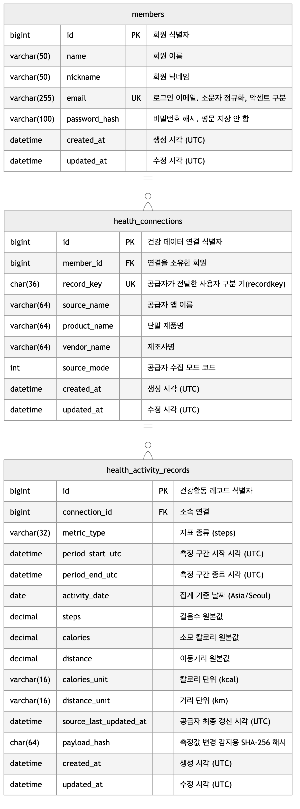

# 데이터베이스 설계

과제 원문의 제출물 2번(데이터베이스 설계 ERD, 코멘트 포함)에 해당합니다.

스키마의 단일 기준은 다음 migration입니다.

- [`V1__init.sql`](../../src/main/resources/db/migration/V1__init.sql)
- [`V2__email_accent_sensitive_collation.sql`](../../src/main/resources/db/migration/V2__email_accent_sensitive_collation.sql)

이 문서와 값이 어긋나면 migration이 옳습니다. 컬럼 타입과 제약을 정한 이유는
[`개발_계획.md`](개발_계획.md)에 있습니다.

## 1. ERD

PNG 생성 원본은 [`ERD.mmd`](./ERD.mmd)입니다.
ERD는 테이블 관계와 주요 타입을 보여주는 개념도이며, 정확한 정밀도와 제약조건은 아래 표와 migration을
따릅니다.

## 2. 공통 제약

세 테이블에 같은 규칙을 적용했으므로 컬럼 표에서 반복하지 않습니다.

- **모든 컬럼이 `NOT NULL`입니다.** 저장 전에 입력 검증과 정규화를 완료하며, `calories`의 `0`은
  결측이 아니라 유효한 값입니다.
- **`id`는 `BIGINT AUTO_INCREMENT` PK입니다.** 애플리케이션이 채번하지 않습니다.
- **`created_at`은 `DEFAULT CURRENT_TIMESTAMP(6)`, `updated_at`은 거기에 더해
  `ON UPDATE CURRENT_TIMESTAMP(6)`입니다.** DDL 기본값이 채우므로 엔티티에 매핑하지 않습니다.
- 모든 시각 컬럼은 `DATETIME(6)`이고 UTC로 저장합니다. JDBC 세션 타임존도 UTC로 고정했습니다.
- 엔진은 `InnoDB`, 문자셋은 `utf8mb4`입니다. 기본 콜레이션은 `utf8mb4_unicode_ci`이며,
  `members.email`만 정규화 범위에 맞춰 악센트를 구분하는 `utf8mb4_0900_as_cs`를 사용합니다.

## 3. 테이블

### 3.1 `members` — 서비스 회원

| 컬럼 | 타입 | 코멘트 |
|---|---|---|
| `id` | `BIGINT` PK | 회원 식별자 |
| `name` | `VARCHAR(50)` | 회원 이름 |
| `nickname` | `VARCHAR(50)` | 회원 닉네임 |
| `email` | `VARCHAR(255)` UK | 로그인 이메일. 앞뒤 공백 제거와 소문자 정규화 후 악센트를 구분합니다 |
| `password_hash` | `VARCHAR(100)` | `DelegatingPasswordEncoder` 형식의 비밀번호 해시. 평문은 저장하지 않습니다 |
| `created_at` | `DATETIME(6)` | 생성 시각 (UTC) |
| `updated_at` | `DATETIME(6)` | 수정 시각 (UTC) |

### 3.2 `health_connections` — 회원과 recordkey의 소유권 연결

| 컬럼 | 타입 | 코멘트 |
|---|---|---|
| `id` | `BIGINT` PK | 건강 데이터 연결 식별자 |
| `member_id` | `BIGINT` FK | 연결을 소유한 회원. 최초 저장 요청을 보낸 회원에게 귀속됩니다 |
| `record_key` | `CHAR(36)` UK | 공급자가 전달한 사용자 구분 키(recordkey). 입력은 36자 문자열입니다 |
| `source_name` | `VARCHAR(64)` | 공급자 앱 이름. 입력의 `data.source.name` (예: `SamsungHealth`, `Health Kit`) |
| `product_name` | `VARCHAR(64)` | 단말 제품명. 입력의 `data.source.product.name` (예: `Android`, `iPhone`) |
| `vendor_name` | `VARCHAR(64)` | 제조사명. 입력의 `data.source.product.vender` (오탈자는 공급자 원본 계약입니다) |
| `source_mode` | `INT` | 공급자가 전달한 수집 모드 코드. 입력의 `data.source.mode` (예: 9, 10) |
| `created_at` | `DATETIME(6)` | 생성 시각 (UTC) |
| `updated_at` | `DATETIME(6)` | 수정 시각 (UTC) |

`record_key`를 UNIQUE로 두어 **recordkey 하나가 회원 한 명에게만 귀속**됩니다. 최초 저장 요청을 보낸
회원이 소유자가 됩니다.

공급자 메타데이터를 레코드마다 반복 저장하지 않고 이 테이블에 한 번만 둡니다.

### 3.3 `health_activity_records` — 정규화한 건강활동 측정 레코드

| 컬럼 | 타입 | 코멘트 |
|---|---|---|
| `id` | `BIGINT` PK | 건강활동 레코드 식별자 |
| `connection_id` | `BIGINT` FK | 소속 연결. 이 값이 recordkey와 공급자 연결을 대표하므로 두 값을 중복 저장하지 않습니다 |
| `metric_type` | `VARCHAR(32)` | 지표 종류. 입력 최상위의 `type` (예: `steps`) |
| `period_start_utc` | `DATETIME(6)` | 측정 구간 시작 시각 (UTC 정규화) |
| `period_end_utc` | `DATETIME(6)` | 측정 구간 종료 시각 (UTC 정규화). 시작과 같을 수 있습니다 |
| `activity_date` | `DATE` | 집계 기준 날짜. 시작 시각을 `app.business-zone`(`Asia/Seoul`)으로 변환해 정합니다 |
| `steps` | `DECIMAL(24,12)` | 정규화한 걸음수 측정값. 공급자가 소수를 보내므로 정밀도를 보존합니다 |
| `calories` | `DECIMAL(24,12)` | 정규화한 소모 칼로리 측정값. 0은 유효한 값입니다 |
| `distance` | `DECIMAL(24,12)` | 정규화한 이동거리 측정값 |
| `calories_unit` | `VARCHAR(16)` | 칼로리 단위. `kcal`만 허용합니다 |
| `distance_unit` | `VARCHAR(16)` | 거리 단위. `km`만 허용합니다 |
| `source_last_updated_at` | `DATETIME(6)` | 공급자가 알린 최종 갱신 시각 (UTC 정규화). 입력의 `lastUpdate` |
| `payload_hash` | `CHAR(64)` | 측정값 변경 감지를 위한 SHA-256 해시(hex). 원본 payload는 저장하지 않습니다 |
| `created_at` | `DATETIME(6)` | 생성 시각 (UTC) |
| `updated_at` | `DATETIME(6)` | 수정 시각 (UTC) |

## 4. 명명된 제약조건과 인덱스

| 이름 | 대상 | 목적 |
|---|---|---|
| `uk_members_email` | `members(email)` | 이메일 중복 가입 차단 |
| `uk_health_connections_record_key` | `health_connections(record_key)` | recordkey 소유권을 한 회원으로 고정 |
| `fk_health_connections_member` | `health_connections(member_id)` | 회원 참조 정합성 |
| **`uk_health_activity_records_identity`** | `(connection_id, metric_type, period_start_utc, period_end_utc)` | **멱등 저장의 최종 보장.** 같은 활동 식별자가 두 행이 되지 않게 막습니다 |
| `fk_health_activity_records_connection` | `health_activity_records(connection_id)` | 연결 참조 정합성 |
| `ix_health_connections_member_record_key` | `(member_id, record_key)` | 회원 기준 연결 조회 |
| **`ix_health_activity_records_connection_date`** | `(connection_id, activity_date)` | **Daily/Monthly 집계 조회의 주 경로** |
| `ix_health_activity_records_connection_period` | `(connection_id, period_start_utc, period_end_utc)` | 기간 범위 조회. 식별자 UNIQUE는 `metric_type`이 두 번째라 기간만으로 쓸 수 없습니다 |
