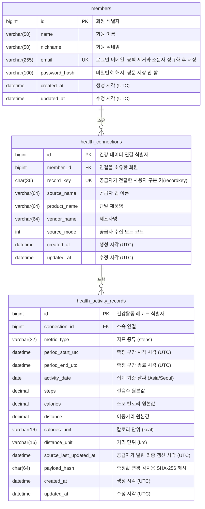

# 데이터베이스 설계

과제 원문의 제출물 2번(데이터베이스 설계 ERD, 코멘트 포함)에 해당한다.

스키마의 단일 기준은 [`V1__init.sql`](../../src/main/resources/db/migration/V1__init.sql)이다. 이
문서의 설명은 그 파일의 `COMMENT`를 옮긴 것이며, 값이 어긋나면 migration이 옳다. 컬럼 타입과 제약을
정한 이유는 [`개발_계획.md`](개발_계획.md)에 있다.

## 1. ERD

## 2. 공통 제약

세 테이블에 같은 규칙을 적용했으므로 컬럼 표에서 반복하지 않는다.

- **모든 컬럼이 `NOT NULL`이다.** 31개 컬럼 전부. 값이 없을 수 있는 컬럼을 두지 않았고, 공급자가
  보내지 않는 값은 정규화 단계에서 거절하거나 기본값을 정한다. `calories`의 `0`은 결측이 아니라
  유효한 값이다.
- **`id`는 `BIGINT AUTO_INCREMENT` PK다.** 애플리케이션이 채번하지 않는다.
- **`created_at`은 `DEFAULT CURRENT_TIMESTAMP(6)`, `updated_at`은 거기에 더해
  `ON UPDATE CURRENT_TIMESTAMP(6)`이다.** DDL 기본값이 채우므로 엔티티에 매핑하지 않는다.
- 모든 시각 컬럼은 `DATETIME(6)`이고 UTC로 저장한다. JDBC 세션 타임존도 UTC로 고정했다.
- 엔진은 `InnoDB`, 문자셋은 `utf8mb4`, 콜레이션은 `utf8mb4_unicode_ci`다.

## 3. 테이블

### 3.1 `members` — 서비스 회원

| 컬럼 | 타입 | 코멘트 |
|---|---|---|
| `id` | `BIGINT` PK | 회원 식별자 |
| `name` | `VARCHAR(50)` | 회원 이름 |
| `nickname` | `VARCHAR(50)` | 회원 닉네임 |
| `email` | `VARCHAR(255)` UK | 로그인 이메일. 앞뒤 공백 제거와 소문자 정규화를 거친 값을 저장한다 |
| `password_hash` | `VARCHAR(100)` | `DelegatingPasswordEncoder` 형식의 비밀번호 해시. 평문은 저장하지 않는다 |
| `created_at` | `DATETIME(6)` | 생성 시각 (UTC) |
| `updated_at` | `DATETIME(6)` | 수정 시각 (UTC) |

`uk_members_email`이 이메일 중복 가입을 막는다. 정규화한 값을 저장하므로 대소문자와 공백만 다른
이메일은 같은 회원으로 취급된다.

### 3.2 `health_connections` — 회원과 recordkey의 소유권 연결

| 컬럼 | 타입 | 코멘트 |
|---|---|---|
| `id` | `BIGINT` PK | 건강 데이터 연결 식별자 |
| `member_id` | `BIGINT` FK | 연결을 소유한 회원. 최초 저장 요청을 보낸 회원에게 귀속된다 |
| `record_key` | `CHAR(36)` UK | 공급자가 전달한 사용자 구분 키(recordkey). 입력은 UUID 36자다 |
| `source_name` | `VARCHAR(64)` | 공급자 앱 이름. 입력의 `data.source.name` (예: `SamsungHealth`, `Health Kit`) |
| `product_name` | `VARCHAR(64)` | 단말 제품명. 입력의 `data.source.product.name` (예: `Android`, `iPhone`) |
| `vendor_name` | `VARCHAR(64)` | 제조사명. 입력의 `data.source.product.vender` (오탈자는 공급자 원본 계약이다) |
| `source_mode` | `INT` | 공급자가 전달한 수집 모드 코드. 입력의 `data.source.mode` (예: 9, 10) |
| `created_at` | `DATETIME(6)` | 생성 시각 (UTC) |
| `updated_at` | `DATETIME(6)` | 수정 시각 (UTC) |

`record_key`를 UNIQUE로 두어 **recordkey 하나가 회원 한 명에게만 귀속**된다. 최초 저장 요청을 보낸
회원이 소유자가 되고, 다른 회원의 저장 요청은 `409`, 조회 요청은 `404`가 된다.

공급자 메타데이터를 레코드마다 반복 저장하지 않고 이 테이블에 한 번만 둔다.

### 3.3 `health_activity_records` — 정규화한 건강활동 측정 레코드

| 컬럼 | 타입 | 코멘트 |
|---|---|---|
| `id` | `BIGINT` PK | 건강활동 레코드 식별자 |
| `connection_id` | `BIGINT` FK | 소속 연결. 이 값이 recordkey와 공급자 연결을 대표하므로 두 값을 중복 저장하지 않는다 |
| `metric_type` | `VARCHAR(32)` | 지표 종류. 입력 최상위의 `type` (예: `steps`) |
| `period_start_utc` | `DATETIME(6)` | 측정 구간 시작 시각 (UTC 정규화) |
| `period_end_utc` | `DATETIME(6)` | 측정 구간 종료 시각 (UTC 정규화). 시작과 같을 수 있다 |
| `activity_date` | `DATE` | 집계 기준 날짜. 시작 시각을 `app.business-zone`(`Asia/Seoul`)으로 변환해 정한다 |
| `steps` | `DECIMAL(24,12)` | 걸음수 원본값. 공급자가 소수를 보내므로 정밀도를 보존한다 |
| `calories` | `DECIMAL(24,12)` | 소모 칼로리 원본값. 0은 유효한 값이다 |
| `distance` | `DECIMAL(24,12)` | 이동거리 원본값 |
| `calories_unit` | `VARCHAR(16)` | 칼로리 단위. `kcal`만 허용한다 |
| `distance_unit` | `VARCHAR(16)` | 거리 단위. `km`만 허용한다 |
| `source_last_updated_at` | `DATETIME(6)` | 공급자가 알린 최종 갱신 시각 (UTC 정규화). 입력의 `lastUpdate` |
| `payload_hash` | `CHAR(64)` | 측정값 변경 감지를 위한 SHA-256 해시(hex). 원본 payload는 저장하지 않는다 |
| `created_at` | `DATETIME(6)` | 생성 시각 (UTC) |
| `updated_at` | `DATETIME(6)` | 수정 시각 (UTC) |

## 4. 명명된 제약조건과 인덱스

| 이름 | 대상 | 목적 |
|---|---|---|
| `uk_members_email` | `members(email)` | 이메일 중복 가입 차단 |
| `uk_health_connections_record_key` | `health_connections(record_key)` | recordkey 소유권을 한 회원으로 고정 |
| `fk_health_connections_member` | `health_connections(member_id)` | 회원 참조 정합성 |
| **`uk_health_activity_records_identity`** | `(connection_id, metric_type, period_start_utc, period_end_utc)` | **멱등 저장의 최종 보장.** 같은 활동 식별자가 두 행이 되지 않게 막는다 |
| `fk_health_activity_records_connection` | `health_activity_records(connection_id)` | 연결 참조 정합성 |
| `ix_health_connections_member_record_key` | `(member_id, record_key)` | 회원 기준 연결 조회 |
| **`ix_health_activity_records_connection_date`** | `(connection_id, activity_date)` | **Daily/Monthly 집계 조회의 주 경로** |
| `ix_health_activity_records_connection_period` | `(connection_id, period_start_utc, period_end_utc)` | 기간 범위 조회. 식별자 UNIQUE는 `metric_type`이 두 번째라 기간만으로 쓸 수 없다 |

## 5. 타입을 이렇게 정한 이유

**측정값을 `DECIMAL(24,12)`로 둔다.** 공급자가 `steps`에도 소수를 보내고 `distance`는 소수점
20자리까지 온다. `DOUBLE`로 받으면 합산에서 오차가 누적되고, 정수로 받으면 값이 잘린다. 소수점
12자리까지 보존하고 그 뒤는 반올림해 저장하며, 4,710건 전체에서 누적 오차가 응답 정밀도보다 약
3,914배 작다는 것을 측정해 확인했다.

**`activity_date`를 저장 시점에 확정한다.** 집계 기준 타임존이 `Asia/Seoul`인데 공급자 시각은
로컬(삼성헬스)과 오프셋(Apple Health)이 섞여 온다. 조회할 때마다 변환하면 집계 쿼리가 인덱스를 쓸 수
없고 같은 데이터가 조회 시점 설정에 따라 다르게 집계된다.

**모든 시각을 UTC로 저장한다.** JDBC 세션 타임존도 UTC로 고정했다. 고정하지 않으면 서버 로캘에 따라
저장 시각이 달라진다.

**`payload_hash`만 저장하고 원본 payload는 저장하지 않는다.** 변경 감지에 필요한 것은 같은지
다른지뿐이고, 원본을 보관하면 개인 건강 데이터가 불필요하게 늘어난다. 해시는 양자화한 측정값과
단위로만 계산하므로 갱신 시각만 바뀐 재전송이 변경으로 오판되지 않는다.

## 6. Redis 키

영속 저장은 MySQL이 담당하고 Redis는 토큰 저장소와 조회 캐시로만 쓴다.

| 키 | 값 | TTL |
|---|---|---|
| `auth:refresh:{memberId}:{tokenId}` | `SHA-256(refreshToken)` | 14일 |
| `health:daily:{recordKey}:{version}:{from}:{to}` | 반올림 전 일별 합계 | 5분 |
| `health:monthly:{recordKey}:{version}:{from}:{to}` | 반올림 전 월별 합계 | 10분 |
| `health:cache-version:{recordKey}` | 세대 번호 | 없음 |

리프레시 토큰은 평문을 저장하지 않는다. 집계 캐시는 저장 성공 후 `version`을 올려 무효화하고, 이전
세대 키는 지우지 않고 TTL로 만료시킨다. `KEYS`와 패턴 삭제는 쓰지 않는다.

**Redis가 멈춰도 조회는 MySQL로 대체된다.** 실기동에서 Redis 컨테이너를 정지시킨 채 일간·월간 조회가
`200`이고 응답 원문이 정지 전과 동일함을 확인했다.
